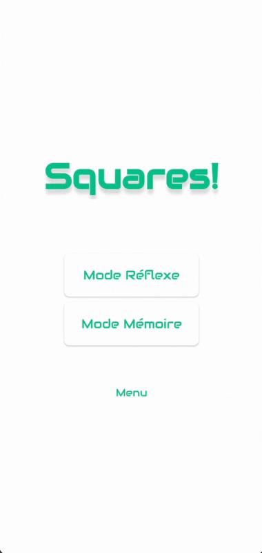
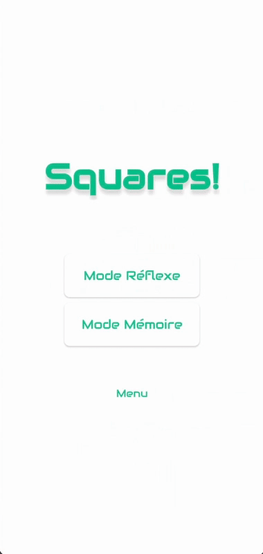

# Squares: test your speed and memory

A minimalist arcade android game to test your speed and memory.

This game has been developped in Kotlin during the first covid-19 lockdown.

## Demo: Speed Mode

Make sur to touch the right square before the next one turns green.

In "Traps / Pièges" mode beware the red square!

   

## Demo: Memory Mode

Fisrt one green square twinkles than the player clicks. Tha game replays te previous one and adds aonther one each time the player recalls the right series. How much steps could you recall?

in "Random / Aléatoire" mode each round the order changes with one more position to recall.

   

## Demo: Settings

   

